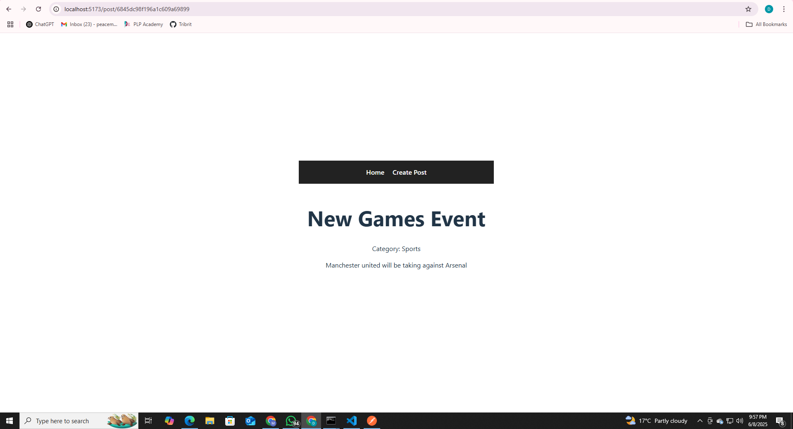

# MERN Stack Blog Application

> Week 4: Deep Dive into MERN Stack Integration Assignment

This is a full-stack **MERN (MongoDB, Express.js, React.js, Node.js)** blog application built as part of the Week 4 assignment. It demonstrates seamless integration between the front-end and back-end components, covering API communication, CRUD operations, and state management.

---

## 🚀 Project Overview

The blog application allows users to:

- View a list of blog posts
- View a single post in detail
- Create new posts
- Edit or delete existing posts
- Categorize posts using MongoDB-backed categories

The app demonstrates clean separation between client and server code, RESTful API design, and dynamic front-end rendering with React.

---

## 🧠 Features Implemented

### ✅ Core Features

- Full CRUD operations for blog posts
- Category management
- RESTful API with Express and MongoDB
- Mongoose models for Posts and Categories
- Form validation
- React Router for navigation
- API services using custom hooks
- Loading and error handling UI

### 🌟 Advanced Features

- Optimistic UI updates
- Image support for posts (can be extended)
- Dynamic dropdowns for category selection
- API error handling middleware

---

## 🛠️ Setup Instructions

### ⚙️ Prerequisites

- Node.js v18+
- MongoDB (local or Atlas)
- npm or yarn
- Git

### 📁 Clone and Install

```bash
# Clone the repo
git clone https://github.com/YOUR-USERNAME/mern-blog.git
cd mern-blog

🔧 Server Setup
cd server
cp .env.example .env    # Configure Mongo URI and PORT

npm install
node seedCategories.js  # Seeds predefined categories
npm run dev             # Starts backend at http://localhost:5000

💻 Client Setup

cd ../client
cp .env.example .env    # VITE_API_BASE_URL should point to backend

npm install
npm run dev             # Starts frontend at http://localhost:3000

📡 API Documentation
🔹 Blog Post Endpoints

| Method | Endpoint         | Description              |
| ------ | ---------------- | ------------------------ |
| GET    | `/api/posts`     | Get all blog posts       |
| GET    | `/api/posts/:id` | Get a specific blog post |
| POST   | `/api/posts`     | Create a new blog post   |
| PUT    | `/api/posts/:id` | Update a blog post       |
| DELETE | `/api/posts/:id` | Delete a blog post       |


🔹 Category Endpoints
| Method | Endpoint          | Description           |
| ------ | ----------------- | --------------------- |
| GET    | `/api/categories` | Get all categories    |
| POST   | `/api/categories` | Create a new category |


🗂️ Directory Structure
mern-blog/
├── client/                 # React front-end (Vite)
│   ├── src/
│   │   ├── components/     # UI Components
│   │   ├── pages/          # Page views
│   │   ├── services/       # API communication
│   │   └── App.jsx
│   ├── public/
│   └── .env.example        # Client env config
├── server/                 # Node + Express backend
│   ├── config/             # MongoDB config
│   ├── controllers/        # Route logic
│   ├── middleware/         # Error handlers
│   ├── models/             # Mongoose schemas
│   ├── routes/             # API routes
│   ├── seedCategories.js   # Category seeder
│   └── .env.example        # Server env config
└── README.md               # Assignment documentation


## 🧪 Screenshots

### 🏠 Home Page  
Displays a list of all available blog posts.


---

### ➕ Create New Post  
Users can add a new blog post with a title, description, and category selection.


---

### 📄 Single Post View  
Shows the full details of a single selected post.




📋 .env Configuration
server/.env.example

MONGO_URI=mongodb://localhost:27017/mern-blog
PORT=5000

client/.env.example

VITE_API_BASE_URL=http://localhost:5000/api

📚 Resources Used
MongoDB

Express.js

React

Node.js

Mongoose

🔚 Developed as part of MERN Integration Assignment – Week 4.

